## About Me

Hi! I'm Adrian Morton, a B.S. Computer Science student at Florida International University with a deep passion for full-stack engineering and designing complex systems. I'm a two-time INIT Build Team Lead with a continuing drive to develop complex projects to deployment, working synchronously with my team to deliver quality solutions. Most of my work consists of backend engineering with the application of AI/ML technologies and frameworks, solving real-world problems with an efficient modern approach. Currently working on full-stack projects with AI/ML integration to simultaneously develop proficiency in both SWE and MLE.

## GitHub Stats

## Experience

* INIT Build | Team Lead – Fall 2025
        * Architected the end-to-end ML system, from data ingestion and feature engineering pipelines to model training, evaluation, and deployment in production-like environments.​
        * Implemented and tuned advanced models (e.g., CatBoost, LightGBM, Temporal Fusion Transformer) with rigorous cross-validation and metric tracking to optimize performance on time-series workloads.
        * Owned core backend services and experimentation scripts in Python, enforcing code quality via Git workflows, modular design, and reproducible training runs.​

* INIT Build | Team Lead – Spring 2026
        * Leading the development of NoteBud, an AI-powered class notebook and study companion built with Python and Typescript that will use retrieval-augmented generation to answer student questions with citations from their own course materials.
        * Designing RAG pipeline using LlamaIndex/LangChain and Gemini to ingest PDFs/slides, chunk and embed content, process through retrieval ranking, groundedness scoring, and then return informed responses with highlighted evidence.
        * Developing a full-stack architecture with Next.js frontend, FastAPI backend, PostgreSQL + pgvector, Docker containerization, and Google Cloud object storage to manage users, classes, notebooks, and source files.
​
* AI4ALL | Fellow
        * Developed production-style ML models in Python (and C# where applicable), including Random Forest and XGBoost, to forecast real-world signals with high predictive accuracy.
        ​* Engineered features, performed hyperparameter tuning, and analyzed error patterns to improve model robustness, documenting pipelines and results for future iteration.​

## Tech Stack

**Languages:** Python • C/C++ • Java • SQL • TypeScript • JavaScript • Rust • Arduino
**ML/AI:** PyTorch • TensorFlow • LlamaIndex • LangChain • Google ADK • Qiskit • NumPy • pandas
**Web & Backend:** FastAPI • Next.js • React • Node.js • Flask • RESTful API • Docker
**Databases:** PostgreSQL • pgvector • Vector Databases • Apache Parquet
**Cloud & Tools:** Google Cloud • Git • Linux • Postman • Wireshark

## Featured Projects

### [NoteBud](https://github.com/Bomoga/NoteBud) | INIT Build Spring 2026
AI-powered study companion with retrieval-augmented generation. Students ask questions and get answers cited from their own course materials.
- **Stack:** Next.js, FastAPI, PostgreSQL + pgvector, Docker, Google Cloud
- **Features:** RAG pipeline with LlamaIndex/Gemini, PDF ingestion, groundedness scoring, highlighted evidence

### [Prenergyze](https://github.com/Bomoga/Prenergyze) | INIT Build Fall 2025
Predictive system for anticipating electric utility grid load peaks to enable dynamic pricing and resource allocation.
- **Stack:** PyTorch, CatBoost, LightGBM, Temporal Fusion Transformer
- **Performance:** R² = 0.9434 on TFT model

### [Hardlaunch](https://github.com/Bomoga/Hardlaunch) | Sharkbyte 2025
Agentic AI workbench that transforms founder ideas into structured business strategies through conversational intake.
- **Stack:** Google ADK, Gemini 2.5, FastAPI, LlamaIndex
- **Features:** Multi-agent system (onboarding, planning, research, analysis), session state management, RAG with vector search

### [Outagent](https://github.com/Bomoga/Outagent) | Shellhacks 2025
High-throughput backend for utility grid operations with sub-minute situational awareness and hourly load forecasting.
- **Stack:** FastAPI, Apache Parquet, PyTorch, LightGBM
- **Features:** Automated retraining pipelines, 12-horizon forecasting, custom feature engineering
