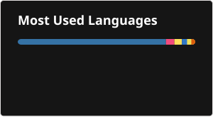

# Hi, I'm Adrian Morton 👋

**Software engineer: backend, LLM evaluation, and AI infrastructure.** B.S. Computer Science (Minor in Mathematical Sciences) at Florida International University, graduating May 2027.

I like building systems that prove their own correctness: eval harnesses for production LLMs, deterministic verifiers for AI-generated code, and over-the-air update pipelines for embedded Linux fleets. I'm currently a software engineering intern at **Genuine Labs** and **Portable Diagnostic Systems**, and I've led two INIT Build teams.

📫 **Open to new-grad SWE roles (from May 2027) and Spring 2027 internships.**

## Highlights

- 🥇 **1st Place, Microsoft sponsor challenge, ShellHacks X** with [Repro](https://github.com/Bomoga/repro)
- 💼 **Two concurrent SWE internships (2026):** LLM evals at Genuine Labs, OTA updates at Portable Diagnostic Systems
- 🧭 **2× INIT Build Team Lead** (Fall 2025 and Spring 2026)
- 🎓 **6× Dean's List** at FIU (Spring 2024 through Spring 2026)

## GitHub Stats

  
  

## Experience

**Genuine Labs** | Software Engineering Intern | *Jun 2026 to present*
- Architecting and building an LLM evaluation framework from the ground up for rigorous testing of production AI systems.
- Designed a JSON-driven eval runner that executes structured test cases against LLM endpoints, with both reference-based grading and LLM-as-judge scoring.
- Engineered a dual-store memory architecture on mem0 and Firestore, with test isolation through purge steps, so eval runs are reproducible in CI.
- Integrated the Firebase Admin SDK for service-account authentication, which resolved auth problems across environments.
- Built logging and failure-reporting pipelines that surface actionable signals from eval runs, and collaborated on memory selection logic, a model provider migration, and dummy Firebase environments for safe dev/test.

**Portable Diagnostic Systems** | Software Engineering Intern | *May 2026 to present*
- Designing and building an over-the-air software update system for the Integrity-1 Analysis System. It rolls out firmware and software across the fleet remotely, which eliminates manual reflashing and on-site servicing.

**Stemtree of Coral Gables** | Programming Instructor | *Jun 2025 to present*
- Design and deliver hands-on programming curriculum in Python, Java, and C/C++ for students at every skill level, with a focus on high-school enrichment.
- Mentor students through project-based work that builds critical thinking, problem-solving, and technical proficiency.

**INIT Build** | Team Lead | *Fall 2025 and Spring 2026*
- Led student teams from architecture to deployment on [NoteBud](https://github.com/Bomoga/NoteBud) and [Prenergyze](https://github.com/Bomoga/Prenergyze).

**AI4ALL** | Fellow
- Built and documented forecasting models with Random Forest and XGBoost, including feature engineering and hyperparameter tuning.

## Featured Projects

### [Repro](https://github.com/Bomoga/repro) | 🥇 1st Place, Microsoft Sponsor Challenge, ShellHacks X
Points AI agents at a codebase, reproduces every finding in a sandbox before reasoning about it, and repairs the code with proof that the fix holds. Built by a team of 4 in 36 hours.
- **My role:** built the agentic diagnosis and autonomous repair lane. Gemini groups reproduced findings by root cause and edits code only through sandboxed tools, and an adversarial Challenger model writes counter-tests to break each patch.
- **Deterministic detection:** Semgrep, gitleaks, osv-scanner, and Ruff run in network-isolated Docker containers. A Fastify/tRPC control plane with MongoDB Atlas run storage opens verified fixes as GitHub pull requests.
- **Stack:** TypeScript, Gemini, Docker, Fastify/tRPC, MongoDB Atlas

### [Specgate](https://github.com/Bomoga/specgate) | Personal
Verifies AI-generated applications against machine-readable specs and emits a verdict for each requirement, with the request and response evidence attached.
- TypeScript monorepo: engine, CLI, GitHub Action, shared contracts, and control plane.
- **Zero-LLM verdict path**, so every verdict is reproducible. It's enforced by ESLint import boundaries, and the tests read the resolved config, so a reordering that silently drops the rule fails CI.
- Source-first probe with adapters for Next.js, Express, and Prisma, plus a deterministic HTTP runner with injected clock and ID sources.
- Three-valued check engine (pass/fail/inconclusive) with 9 distinct unverified reasons to prevent false passes. It's validated by **~1,890 tests** and a **24-app corpus** of seeded defects.

### [NoteBud](https://github.com/Bomoga/NoteBud) | INIT Build Spring 2026 (Team Lead)
An AI-powered class notebook, inspired by NotebookLM and Obsidian, that answers student questions with citations from their own course materials and notes.
- **Stack:** Next.js, FastAPI, Neo4j, Docker, Google Cloud Storage
- **RAG pipeline:** LlamaIndex/LangChain and Gemini ingest PDFs and slides, then chunk, embed, rank retrieval, score groundedness, and return answers with highlighted evidence.

### [Prenergyze](https://github.com/Bomoga/Prenergyze) | INIT Build Fall 2025 (Team Lead)
Predicts electric-grid load peaks so a smart grid can use dynamic pricing and allocate resources efficiently.
- **Models:** CatBoost (R² = 0.9300), LightGBM (R² = 0.9318), Temporal Fusion Transformer (**R² = 0.9434**)
- **Stack:** Python, PyTorch

### More projects
- **[Outagent](https://github.com/Bomoga/Outagent)** (ShellHacks 2025): high-throughput grid-operations backend with sub-minute situational awareness and 12-horizon hourly load forecasting. *FastAPI, Apache Parquet, PyTorch, LightGBM*
- **[Hardlaunch](https://github.com/Bomoga/Hardlaunch)** (SharkByte 2025): multi-agent workbench that turns founder ideas into structured business strategies through conversational intake. *Google ADK, Gemini 2.5, FastAPI, LlamaIndex*
- **[Benji](https://github.com/Bomoga/Benji)** (Software Engineering II, Summer 2026): payroll system for a local education center, covering timesheet approval, pay computation, and payroll records. Built by a 3-person team across the full SDLC.

## Tech Stack

**Languages:** Python • TypeScript • JavaScript • C/C++ • Java • C# • SQL • Rust • HTML/CSS • Arduino

**AI / ML:** PyTorch • TensorFlow • LangChain • LlamaIndex • Google ADK • mem0 • Qiskit • NumPy • pandas • Matplotlib • Seaborn

**Backend & Web:** FastAPI • Node.js • Express • Fastify/tRPC • Flask • Next.js • React • RESTful APIs

**Data:** PostgreSQL • Neo4j • MongoDB • Firestore • Vector Databases • Apache Parquet

**Cloud & Tools:** Google Cloud • Firebase • Docker • GitHub Actions • Git • Linux • Postman • Wireshark • Oracle VirtualBox

**CAD:** Fusion 360 • Onshape • Shapr3D

**Coursework:** Data Structures & Algorithms • Operating Systems • Net-Centric Computing • Database Management • Machine Learning • Deep Learning • Data Mining • Quantum Computing • Algorithm Techniques • Software Engineering I/II
